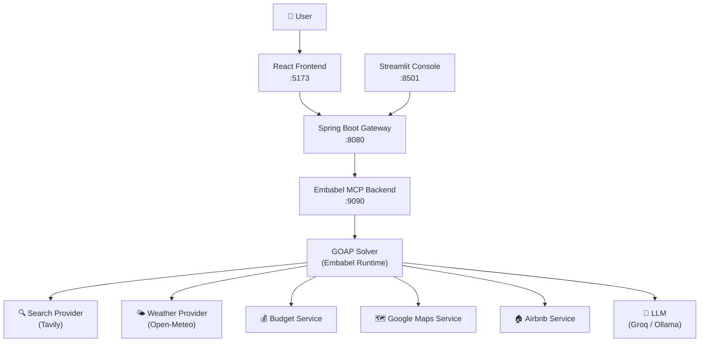

# 🌍 LLM-GOAP Planner

> **An AI-powered travel planning system** that combines Goal-Oriented Action Planning (GOAP) with Large Language Models (LLMs) to generate intelligent, multi-faceted travel itineraries — including weather forecasts, budget estimates, route details, and accommodation suggestions.

[](https://openjdk.org/)
[](https://spring.io/projects/spring-boot)
[](https://react.dev/)
[](https://www.typescriptlang.org/)
[](https://python.org/)

---

## 📋 Table of Contents

- [Overview](#-overview)
- [Architecture](#-architecture)
- [Prerequisites](#-prerequisites)
- [API Keys Required](#-api-keys-required)
- [Quick Start](#-quick-start)
- [Detailed Setup](#-detailed-setup)
- [Configuration Reference](#-configuration-reference)
- [Usage](#-usage)
- [Project Structure](#-project-structure)
- [Troubleshooting](#-troubleshooting)

---

## 🚀 Overview

LLM-GOAP Planner is a full-stack travel planning workspace that uses **GOAP (Goal-Oriented Action Planning)** to decompose complex travel queries into structured, executable actions. Instead of relying on a single LLM call, it chains multiple specialized agents — search, weather, budget, maps, and accommodation — to build a comprehensive travel plan.

**Key Features:**
- 🗺️ **Smart Destination Extraction** — Parses natural language queries to identify destinations
- ☀️ **Day-by-Day Weather Forecast** — LLM-enhanced, date-aware weather reports
- 💰 **Dynamic Budget Calculation** — Uses live search data + LLM reasoning to estimate real costs
- 🏠 **Accommodation Suggestions** — Airbnb-style listing integration
- 🗺️ **Route & Directions** — Google Maps powered route planning
- 📊 **Execution Trace Visualization** — Mermaid diagrams of the GOAP action graph

---

## 🏗️ Architecture



**Components:**

| Component | Tech | Port | Description |
|-----------|------|------|-------------|
| **React Frontend** | React 19 + TypeScript + Vite | `5173` | Premium user-facing planning interface |
| **Spring Boot Gateway** | Spring Boot 3.5 + Java 17 | `8080` | API gateway routing requests to the backend |
| **Embabel MCP Backend** | Spring Boot 3.3 + Java 21 + Embabel | `9090` | Core GOAP planning engine with AI agents |
| **Streamlit Console** | Python + Streamlit | `8501` | Developer debug console for traces & metrics |

---

## ✅ Prerequisites

Ensure the following are installed on your system before proceeding:

| Requirement | Version | Notes |
|-------------|---------|-------|
| **Java JDK** | 21+ (for MCP Backend), 17+ (for Gateway) | Must be on your `PATH`. [Download OpenJDK](https://adoptium.net/) |
| **Node.js** | 18+ | Required for the React frontend. [Download Node.js](https://nodejs.org/) |
| **npm** | 8+ | Bundled with Node.js |
| **Python** | 3.10+ | Required for Streamlit console only. [Download Python](https://python.org/) |
| **Git** | Any | For cloning the repository |

> **Optional:** [Ollama](https://ollama.com/) if you want to run local LLMs instead of Groq cloud.

---

## 🔑 API Keys Required

You need **at least one LLM key** and **Tavily** for search. Google Maps is optional.

| Key | Service | How to Get | Required? |
|-----|---------|-----------|-----------|
| `GROQ_API_KEY` | [Groq](https://console.groq.com/) | Free tier available | **Yes** (or use Ollama) |
| `TAVILY_API_KEY` | [Tavily](https://tavily.com/) | Free tier: 1000 req/month | **Yes** |
| `GOOGLE_MAPS_API_KEY` | [Google Cloud](https://console.cloud.google.com/) | Requires billing enabled | Optional |

---

## ⚡ Quick Start

```powershell
# 1. Clone the repository
git clone https://github.com/Arkur745/llm-goap-planner.git
cd llm-goap-planner

# 2. Configure API keys (see Configuration section below)
#    Edit: embabel-mcp/src/main/resources/application-local.properties

# 3. Start backend (Port 9090) — Terminal 1
cd embabel-mcp
.\mvnw.cmd spring-boot:run

# 4. Start gateway (Port 8080) — Terminal 2 (from project root)
.\mvnw.cmd spring-boot:run

# 5. Start frontend (Port 5173) — Terminal 3
cd frontend
npm install
npm run dev
```

Open **http://localhost:5173** and start planning! 🎉

---

## 📖 Detailed Setup

### Step 1 — Clone the Repository

```powershell
git clone https://github.com/Arkur745/llm-goap-planner.git
cd llm-goap-planner
```

### Step 2 — Configure API Keys

Create or edit the local properties override file:

```
embabel-mcp/src/main/resources/application-local.properties
```

Add your API keys:

```properties
# LLM Provider (Groq - free tier available at console.groq.com)
groq.api.key=gsk_YOUR_GROQ_KEY_HERE
spring.ai.openai.api-key=gsk_YOUR_GROQ_KEY_HERE

# Search Provider (Tavily - free tier at tavily.com)
embabel.search.tavily.api-key=tvly-YOUR_TAVILY_KEY_HERE

# Google Maps (optional - for route planning)
google.maps.api-key=YOUR_GOOGLE_MAPS_KEY_HERE
```

> ⚠️ **Never commit your API keys to Git.** The `application-local.properties` file is already listed in `.gitignore`.

### Step 3 — Start the Embabel MCP Backend

Open a new terminal and run:

```powershell
cd embabel-mcp
.\mvnw.cmd spring-boot:run
```

**Expected output:** Server starts on `http://localhost:9090`

Wait until you see:
```
Started EmbabelMcpApplication in X.XXX seconds
```

### Step 4 — Start the Spring Boot Gateway

Open **another** terminal in the project root:

```powershell
.\mvnw.cmd spring-boot:run
```

**Expected output:** Server starts on `http://localhost:8080`

### Step 5 — Start the React Frontend

Open **another** terminal:

```powershell
cd frontend
npm install
npm run dev
```

**Expected output:** Vite development server starts at `http://localhost:5173`

### Step 6 (Optional) — Start the Streamlit Console

For developer debugging and trace inspection:

```powershell
cd streamlit-ui
python -m venv venv
.\venv\Scripts\activate
pip install -r requirements.txt
streamlit run app.py
```

Opens at **http://localhost:8501**

---

## ⚙️ Configuration Reference

### Embabel MCP Backend (`embabel-mcp/src/main/resources/application.properties`)

| Property | Default | Description |
|----------|---------|-------------|
| `server.port` | `9090` | Backend service port |
| `embabel.llm.provider` | `groq` | LLM provider: `groq`, `openai`, `ollama` |
| `embabel.models.default-llm` | `llama-3.1-8b-instant` | Default LLM model name |
| `spring.ai.openai.base-url` | `https://api.groq.com/openai` | API base URL (Groq uses OpenAI-compatible API) |
| `spring.ai.openai.chat.options.model` | `llama-3.1-8b-instant` | Chat model for Groq |
| `spring.ai.ollama.base-url` | `http://localhost:11434` | Ollama local server URL |
| `embabel.search.provider` | `auto` | Search provider: `auto`, `tavily`, `brave` |
| `embabel.search.max-results` | `5` | Max search results per query |
| `google.maps.api-key` | _(env var)_ | Google Maps API key |

### Using Ollama (Local LLM — No API Key Required)

1. Install Ollama from [https://ollama.com/](https://ollama.com/)
2. Pull a model: `ollama pull llama3`
3. Update `application-local.properties`:

```properties
spring.ai.model.chat=ollama
spring.ai.ollama.chat.options.model=llama3
```

---

## 🎯 Usage

### Planning a Trip

Type any natural language travel query in the frontend:

| Query Type | Example |
|------------|---------|
| Full itinerary | `Plan a 5-day trip to Paris` |
| Weekend trip | `Plan a weekend in Prague` |
| Budget focus | `What's the budget for 3 days in Tokyo?` |
| Weather check | `What's the weather in Rome from 2025-08-10 to 2025-08-14?` |
| General search | `What are the best things to do in Barcelona?` |

### Direct API Access

You can also call the APIs directly:

**Plan via Gateway (Port 8080):**
```powershell
Invoke-RestMethod -Uri "http://localhost:8080/api/plans" `
  -Method Post `
  -ContentType "application/json" `
  -Body '{"goal": "Plan a weekend in Rome"}'
```

**Plan via Backend (Port 9090):**
```powershell
Invoke-RestMethod -Uri "http://localhost:9090/plan" `
  -Method Post `
  -ContentType "application/json" `
  -Body '{"goal": "Plan a 3 day trip to Vienna"}'
```

---

## 📁 Project Structure

```
llm-goap-planner/
│
├── 📂 embabel-mcp/                    Embabel GOAP Planning Backend (Port 9090)
│   ├── src/main/java/com/cps/mcp/
│   │   ├── agent/                     TravelPlannerAgent — Core GOAP agent
│   │   ├── controller/                REST controllers (PlanController, MCPController)
│   │   ├── budget/                    Budget calculation service & models
│   │   ├── weather/                   Weather provider (Open-Meteo)
│   │   ├── search/                    Search provider (Tavily)
│   │   ├── maps/                      Google Maps service
│   │   ├── airbnb/                    Accommodation listing service
│   │   ├── model/                     Shared domain models
│   │   ├── config/                    Spring/Embabel LLM config
│   │   └── util/                      Trace mappers & graph builders
│   └── src/main/resources/
│       ├── application.properties     Main config (edit for environment vars)
│       └── application-local.properties  Local overrides (add your API keys here)
│
├── 📂 frontend/                       React + TypeScript Frontend (Port 5173)
│   ├── src/
│   │   ├── features/planner/          Core planning feature (form, results, hooks)
│   │   ├── shared/                    Shared UI components
│   │   ├── store/                     Zustand state management
│   │   └── App.tsx                    Application root
│   ├── package.json                   Node dependencies
│   └── vite.config.ts                 Vite build configuration
│
├── 📂 src/                            Spring Boot Gateway (Port 8080)
│   └── main/java/                     Gateway controllers & proxy logic
│
├── 📂 streamlit-ui/                   Python Streamlit Dev Console (Port 8501)
│   ├── app.py                         Main Streamlit app
│   ├── api_client.py                  Gateway API client
│   └── requirements.txt              Python dependencies
│
├── 📂 planner/                        Python planning bridge utilities
├── 📂 docs/                           Detailed documentation
│   ├── ARCHITECTURE.md               System architecture deep-dive
│   ├── API_REFERENCE.md              Full API documentation
│   ├── SETUP.md                      Extended setup guide
│   └── ADDING_AGENTS.md             Guide for adding new GOAP agents
│
├── README.md                          ← You are here
├── pom.xml                            Gateway Maven config
└── requirements.txt                   Root Python dependencies
```

---

## 🔧 Troubleshooting

### Backend won't start

**Port already in use:**
```powershell
# Find what's using port 9090
Get-NetTCPConnection -LocalPort 9090 | Select-Object OwningProcess
# Kill the process
Stop-Process -Id <PID> -Force
```

**API key not set:**
- Ensure `application-local.properties` contains valid keys
- Or set environment variables: `$env:GROQ_API_KEY="gsk_..."`

### Frontend shows connection errors

- Ensure both the **Gateway (8080)** and **Backend (9090)** are running
- Check browser console for CORS errors
- Gateway proxies `/api/plans` → Backend `/plan`

### LLM responses are poor quality

- Try switching to a larger model: set `spring.ai.openai.chat.options.model=llama-3.3-70b-versatile` in `application-local.properties`
- Groq free tier has rate limits — space out requests if you hit 429 errors

### No search results returned

- Verify your `TAVILY_API_KEY` is valid at [app.tavily.com](https://app.tavily.com)
- Free tier allows 1,000 API calls/month

---

## 📚 Additional Documentation

| Document | Description |
|----------|-------------|
| [ARCHITECTURE.md](docs/ARCHITECTURE.md) | Deep dive into GOAP runtime, blackboard lifecycle, and system design |
| [API_REFERENCE.md](docs/API_REFERENCE.md) | Complete REST API reference with request/response schemas |
| [SETUP.md](docs/SETUP.md) | Extended setup guide with advanced configuration |
| [ADDING_AGENTS.md](docs/ADDING_AGENTS.md) | How to extend the system with new GOAP agents |
| [ADDING_TOOLS.md](docs/ADDING_TOOLS.md) | How to add new MCP tools to the planner |

---

## 📄 License

This project is licensed under the MIT License — see the [LICENSE](LICENSE) file for details.
