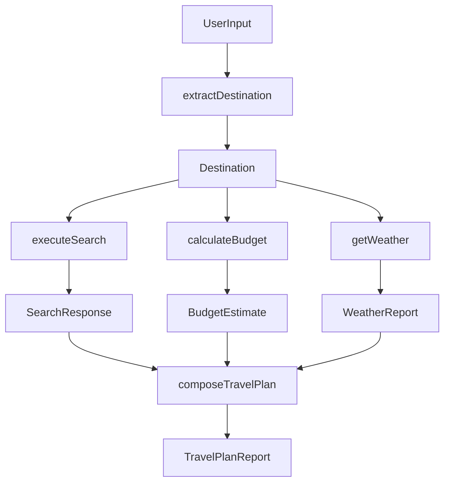

# Adding Custom Agents to the Embabel MCP Backend

This guide explains how to define, annotate, and register custom Goal-Oriented Action Planning (GOAP) agents in the Embabel MCP backend.

---

## 1. Declarative Agent Annotations

The Embabel runtime relies on declarative annotations to discover agents and solve plan paths based on type constraints.

### A. `@Agent`
Applied at the class level. Tells the Embabel runtime that this class defines a set of actions and capabilities that can be invoked by the solver.
* **Fields**:
  * `name`: The logical identifier of the agent.
  * `description`: A brief summary of what the agent is designed to do.

```java
@Agent(name = "TravelPlannerAgent", description = "Travel planner agent that searches and calculates budgets for trips")
@Component
public class TravelPlannerAgent { ... }
```

### B. `@Action`
Applied at the method level. Declares an action that can be scheduled by the GOAP solver.
* **Fields**:
  * `description`: Clarifies what the action accomplishes.
* **Preconditions**: Inferred from the method's parameters.
* **Effects (Postconditions)**: Inferred from the method's return type.

```java
@Action(description = "Extract destination from user prompt")
public Destination extractDestination(UserInput input) { ... }
```

### C. `@AchievesGoal`
Applied at the method level. Marks the final action that satisfies the agent's ultimate objective.
* **Fields**:
  * `description`: The logical description matching the goal string (e.g., "Plan Travel Itinerary").

```java
@Action(description = "Compose travel plan report")
@AchievesGoal(description = "Plan Travel Itinerary")
public TravelPlanReport composeTravelPlan(SearchResponse searchData, BudgetEstimate budgetData, WeatherReport weatherData) { ... }
```

---

## 2. Blackboard DTO Design & Lifecycle

The **Blackboard** is a shared memory space representing the agent process session. Rather than relying on simple state string flags (e.g., `has_destination = true`), the Embabel runtime uses a **strongly-typed Blackboard**.

### A. Type-Based Preconditions and Postconditions
* **Preconditions**: If an action method takes an object of type `T` as a parameter, the planner ensures that an instance of `T` is present on the blackboard before scheduling that action.
* **Postconditions (Effects)**: The object returned by the action is automatically bound to the blackboard, making it available to subsequent actions.

### B. Defining Custom DTOs
Define DTOs as simple nested or top-level classes. Always use meaningful types to avoid parameter mismatching (e.g., avoid passing raw strings or maps when a specific model can represent the domain).

```java
public static class Destination {
    private final String name;
    public Destination(String name) { this.name = name; }
    public String name() { return name; }
    @Override public String toString() { return name; }
}

public static class TravelPlanReport {
    private final String content;
    public TravelPlanReport(String content) { this.content = content; }
    public String content() { return content; }
    @Override public String toString() { return content; }
}
```

---

## 3. Reference Implementation: `TravelPlannerAgent`

Below is the complete structure of [TravelPlannerAgent.java](file:///c:/dev/cps/llm-goap-planner/embabel-mcp/src/main/java/com/cps/mcp/agent/TravelPlannerAgent.java), which serves as the core reference for planner-driven action composition.

```java
package com.cps.mcp.agent;

import com.embabel.agent.api.annotation.Agent;
import com.embabel.agent.api.annotation.Action;
import com.embabel.agent.api.annotation.AchievesGoal;
import com.embabel.agent.domain.io.UserInput;
import com.cps.mcp.search.provider.SearchProvider;
import com.cps.mcp.search.model.SearchResponse;
import com.cps.mcp.budget.service.BudgetService;
import com.cps.mcp.budget.model.BudgetEstimate;
import com.cps.mcp.weather.model.WeatherReport;
import com.cps.mcp.weather.provider.WeatherProvider;
import org.springframework.stereotype.Component;
import org.springframework.beans.factory.annotation.Autowired;

@Agent(name = "TravelPlannerAgent", description = "Travel planner agent that searches and calculates budgets for trips")
@Component
public class TravelPlannerAgent {

    private final SearchProvider searchProvider;
    private final BudgetService budgetService;
    private final WeatherProvider weatherProvider;

    public TravelPlannerAgent(SearchProvider searchProvider, BudgetService budgetService, WeatherProvider weatherProvider) {
        this.searchProvider = searchProvider;
        this.budgetService = budgetService;
        this.weatherProvider = weatherProvider;
    }

    // --- Blackboard DTOs ---
    public static class Destination {
        private final String name;
        public Destination(String name) { this.name = name; }
        public String name() { return name; }
    }

    public static class TravelPlanReport {
        private final String content;
        public TravelPlanReport(String content) { this.content = content; }
        public String content() { return content; }
    }

    // --- Action Methods ---

    // Precondition: UserInput (provided when runtime starts)
    // Postcondition: Destination
    @Action(description = "Extract destination from user prompt")
    public Destination extractDestination(UserInput input) {
        // ... parse destination name from user input prompt ...
        return new Destination(name);
    }

    // Precondition: Destination
    // Postcondition: SearchResponse
    @Action(description = "Search travel details for destination")
    public SearchResponse executeSearch(Destination dest) throws Exception {
        return searchProvider.search(dest.name());
    }

    // Precondition: Destination
    // Postcondition: WeatherReport
    @Action(description = "Get weather forecast for destination")
    public WeatherReport getWeather(Destination dest) throws Exception {
        return weatherProvider.getWeather(dest.name());
    }

    // Precondition: Destination
    // Postcondition: BudgetEstimate
    @Action(description = "Calculate travel budget for destination")
    public BudgetEstimate calculateBudget(Destination dest) {
        return budgetService.estimateTripBudget(dest.name(), days, hotel, food, transport, misc);
    }

    // Preconditions: SearchResponse, BudgetEstimate, WeatherReport
    // Postcondition: TravelPlanReport (Fulfills the goal "Plan Travel Itinerary")
    @Action(description = "Compose travel plan report")
    @AchievesGoal(description = "Plan Travel Itinerary")
    public TravelPlanReport composeTravelPlan(SearchResponse searchData, BudgetEstimate budgetData, WeatherReport weatherData) {
        // ... assemble final report formatting search, budget, and weather summaries ...
        return new TravelPlanReport(reportText);
    }
}
```

### Dynamic Execution Graph Generation
When the goal `"Plan Travel Itinerary"` is executed:
1. The solver searches for an action annotated with `@AchievesGoal(description = "Plan Travel Itinerary")`. It finds `composeTravelPlan`.
2. It examines the parameters of `composeTravelPlan`: `SearchResponse`, `BudgetEstimate`, and `WeatherReport`. None of these exist on the blackboard yet.
3. It searches for actions that produce these types:
   * `executeSearch` produces `SearchResponse` (requires `Destination`).
   * `calculateBudget` produces `BudgetEstimate` (requires `Destination`).
   * `getWeather` produces `WeatherReport` (requires `Destination`).
4. It searches for an action that produces `Destination`:
   * `extractDestination` produces `Destination` (requires `UserInput`).
5. Since `UserInput` is placed on the blackboard at initialization, the planner can build and execute the full sequence:



---

## 4. Troubleshooting Agent Resolution

* **`No agent capable of fulfilling goal`**: Ensure your goal-achieving action has `@AchievesGoal` with the exact string matches description.
* **`Ambiguous parameter matching`**: If multiple objects of the same class type are required as parameters, the planner may fail to resolve which is which unless you use distinct class types (strongly typed DTOs).
* **Missing Beans**: Ensure your Agent is annotated with `@Component` so it is registered in the Spring container.
