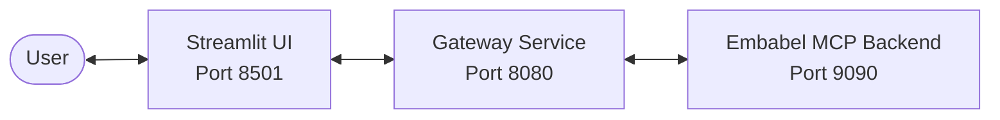
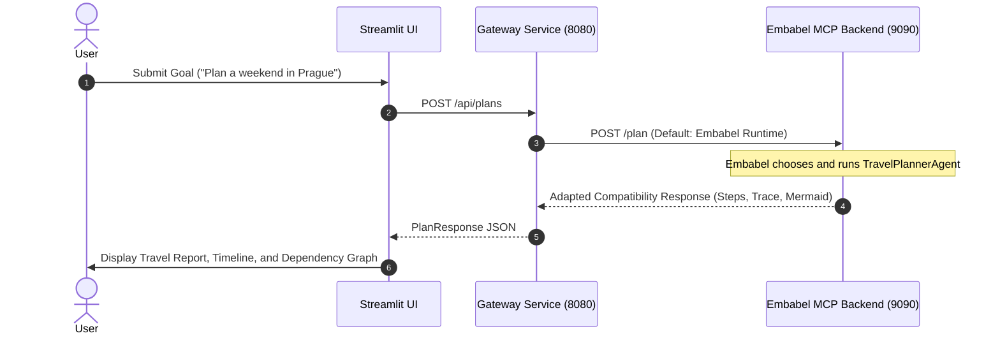
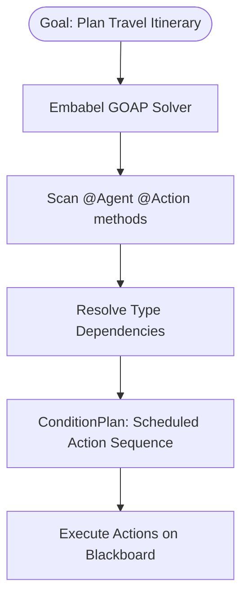
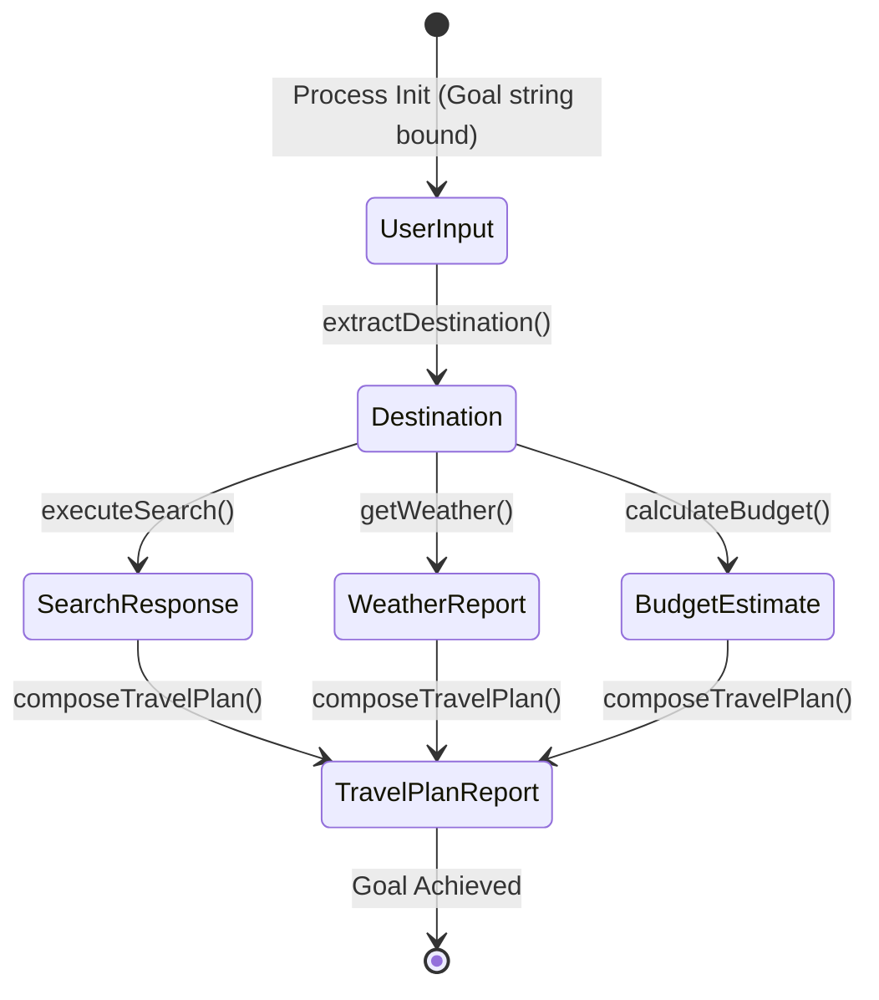
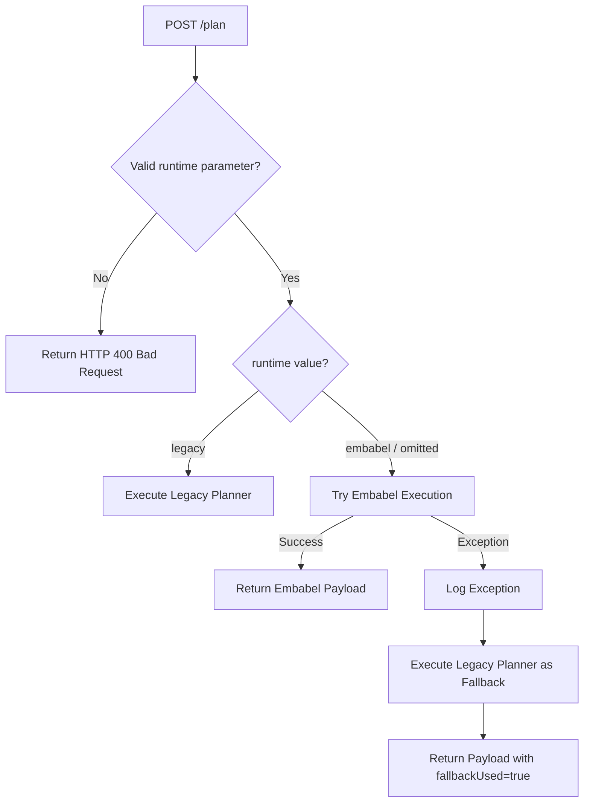

# System Architecture

This document provides a developer-facing overview of the Embabel MCP backend and gateway project architecture.

---

## 1. High-Level System Architecture

The project consists of three primary components that orchestrate planning and tool execution:

1. **Streamlit UI (Port 8501)**: An interactive frontend dashboard for executing goals, inspecting blackboard state transitions, viewing execution timelines, and displaying dependency graphs.
2. **Gateway Service (Port 8080)**: Acts as an orchestrator, proxying requests to the backend planner and providing fallback planning mechanisms using LLM generators or static blueprint templates.
3. **Backend / Embabel MCP Service (Port 9090)**: Hosts the Embabel runtime, executing Goal-Oriented Action Planning (GOAP) agents and exposing MCP tools (weather, search, etc.).

---

## 2. Request Handoff and Routing Flow

When a goal is submitted via the UI, the request traverses the services as follows:

---

## 3. Embabel Agent Runtime Architecture

The backend utilizes the **Embabel Agent Runtime**, which decouples manual step orchestration into declarative, type-based conditions.

* **Autonomy**: Injected via Spring's `Autonomy` bean, orchestrating the discovery of agents capable of fulfilling goals.
* **AgentProcess**: Represents a single execution session containing action invocation history, timing, status, and the data blackboard.
* **Blackboard**: A shared memory space where executing actions query preconditions and bind outputs.

---

## 4. Blackboard Lifecycle & Type Resolution

The planner operates entirely on **type preconditions and effects**. Rather than tracking abstract string flags, the world state is defined by the presence of strongly-typed DTOs on the process blackboard:

1. **`UserInput`**: Bound to the blackboard upon process initialization (contains the raw goal prompt).
2. **`Destination`**: Produced by `extractDestination(UserInput)`. Holds the parsed destination name.
3. **`SearchResponse`**, `WeatherReport`, `BudgetEstimate`: Independently triggered by actions requiring `Destination` as a parameter. They are bound to the blackboard as their respective executions complete.
4. **`TravelPlanReport`**: Triggered by `composeTravelPlan(SearchResponse, BudgetEstimate, WeatherReport)`. Fulfills the ultimate agent goal `@AchievesGoal(description = "Plan Travel Itinerary")`.

---

## 5. MCP Tool Architecture

MCP tools are grouped under declarative **Tool Groups** extending Spring-managed components:
* **Tool Group Registration**: Declared using the `@Component` annotation. Contains `@Tool` mappings exposing capabilities to LLMs or planners.
* **Separation of Concerns**: Tool groups act as controllers that route execution to underlying providers (e.g. `SearchToolGroup` routes to `TavilySearchProvider`; `WeatherToolGroup` routes to `OpenMeteoWeatherProvider`).

---

## 6. Runtime Selection & Fallback Routing

The `PlanController` provides high availability by wrapping the default Embabel execution path in a catch-all fallback block that drops back to the legacy planner if any exception is encountered.

