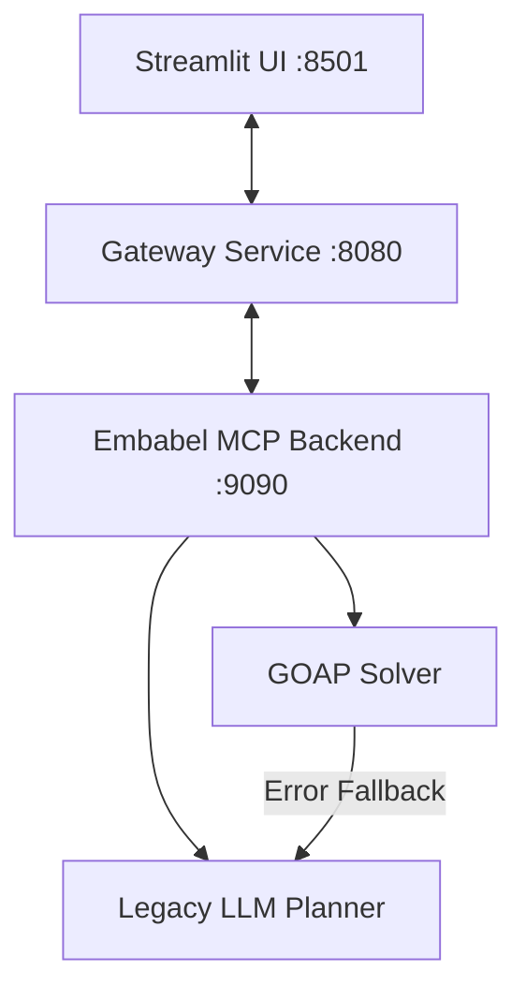

# Project Status & Roadmap

This document outlines the current state, implemented capabilities, limitations, future roadmap, and production readiness assessment of the LLM-GOAP planning platform.

---

## 1. Implemented Features

*   **Production Embabel Agent Runtime**:
    *   Goal-Oriented Action Planning (GOAP) solver executing on Port `9090`.
    *   Type-based blackboard binding and dependency resolution.
    *   Dynamic reflection adapters mapping agent history to compatible frontend structures.
*   **High-Availability REST Routing**:
    *   Backend `POST /plan` defaulting to the Embabel runtime.
    *   Automatic fallback to the legacy planner if the Embabel runtime throws an exception.
    *   Parameter and body-level runtime validation with HTTP 400 bad request protection.
*   **Tavily Search Integration**:
    *   Production-quality HTTP integration with Tavily REST APIs inside `SearchToolGroup`.
    *   Response data normalization, deduplication, and single-attempt retry rules.
*   **Weather MCP Tool Integration**:
    *   Two-phase geocoding and forecast lookup targeting Open-Meteo REST APIs inside `WeatherToolGroup`.
    *   Severity mappings for WMO weather codes.
*   **Streamlit Developer Console**:
    *   Dashboard on Port `8501` visualizing active plans, executions, and step lists.
    *   Blackboard state progression tracker.
    *   Graphviz directed dependency graph builder with textual fallbacks.
*   **Comprehensive Test Coverage**:
    *   Full suite of 63 integration and unit tests passing green.

---

## 2. Current Architecture Status

The current architecture is a robust, rollback-safe hybrid layout:



*   **Default Execution**: Requests route to the Embabel runtime, executing actions dynamically via `TravelPlannerAgent`.
*   **Resiliency**: Exceptions during Embabel execution automatically fall back to the legacy planner, returning the plan details alongside `fallbackUsed=true` and the failure reason, ensuring zero service disruption.

---

## 3. Known Limitations

1.  **Linear Action Chains in Fallback**: The legacy LLM planner links actions linearly (e.g., `step_{j-1}_done` $\rightarrow$ `step_j_done`). It does not fully exploit GOAP's ability to plan non-linear execution paths.
2.  **Ollama Fallback Bypass**: The Gateway's internal `LLMPlanGenerator` connection to Ollama is disabled, meaning an offline 9090 backend will immediately fall back to static templates.
3.  **Brittle Regex Task Parser**: LLM plan task decomposition uses plaintext parsing. If the LLM output diverges from the expected `Description | AgentName` format, agent assignments fall back to `SearchAgent`.
4.  **Mock MCP Compliance**: Simulated agent endpoints on the backend are structured REST endpoints rather than standard JSON-RPC over stdio or Server-Sent Events (SSE) as defined by the official Model Context Protocol (MCP) standard.
5.  **Hardcoded Baseline Date**: The baseline date for all timeline Gantt operations is hardcoded to `2024-01-01`.

---

## 4. Deferred Features & Future Roadmap

*   **Official MCP JSON-RPC Compliance**: Transition the mock agent endpoints (`CalendarAgent`, `BudgetAgent`, `FoodAgent`) to standard JSON-RPC transport to support third-party clients like Claude Desktop.
*   **Advanced DAG Planning**: Support branching path resolution and parallel action executions.
*   **Structured LLM Output**: Utilize LLM JSON mode or schema definition settings (e.g., tools call bindings) to eliminate regex task extraction errors.
*   **Dynamic Gantt Baselines**: Map Gantt charts relative to the planning execution timestamp instead of a hardcoded date.
*   **Database Persistence**: Store executed plans, timelines, and blackboard state traces for historical lookup and auditing.

---

## 5. Production Readiness Assessment

*   **Stability**: **High**. The system is highly stable for local developer testing, debugging, and experimentation. The automatic fallback strategy ensures planning succeeds even when LLM or coordinate geocoding calls throw transient exceptions.
*   **Security**: **Low**. The APIs do not implement authentication or request rate limiting. They are designed for trusted local network loopbacks.
*   **Scalability**: **Medium**. The backend processes planning requests synchronously. For a production deployment with high concurrent traffic, execution should be shifted to asynchronous workers or reactive pipelines.

---

## 6. Demo Screenshots

### A. Streamlit Dashboard
The central control panel allowing developers to input goals, choose LLM providers, select tools, and view final plans.


### B. Planner Graph
Visualizes the resolved dependency flowchart mapping precondition-to-effect edges dynamically using Graphviz rendering.


### C. Trace Viewer
Inspects the sequential blackboard state evolution. Developers can click steps to see which types were added at each execution node.


### D. Travel Report (Output Sample)
A markdown-formatted final travel report compiled dynamically from the final blackboard object (`TravelPlanReport`).

```text
==================================================
TRIP PLAN: Tokyo
==================================================

[1] Travel Summary
--------------------------------------------------
Itinerary and cost calculations successfully finalized.
Destination is verified via active search.
Total trip cost: 1275.00

[2] Search Highlights
--------------------------------------------------
- Tokyo - Wikipedia (https://en.wikipedia.org/wiki/Tokyo):
  Tokyo, officially the Tokyo Metropolis, is the capital and most populous city of Japan. 
  It is Japan's economic center and the seat of the Japanese government.

[3] Budget Estimate
--------------------------------------------------
- Duration: 5 days
- Hotel per Day: 120.00
- Food per Day: 60.00
- Transport per Day: 50.00
- Misc per Day: 25.00

Budget Breakdown:
  * Hotel: 600.00
  * Food: 300.00
  * Transport: 250.00
  * Misc: 125.00

[4] Weather Forecast
--------------------------------------------------
- Location: Tokyo
- Condition: Mostly Sunny
- Temperature: 22.5°C
- Humidity: 55.0%
- Wind Speed: 10.0 km/h
- Severity: GOOD
- Provider: open-meteo
```
